

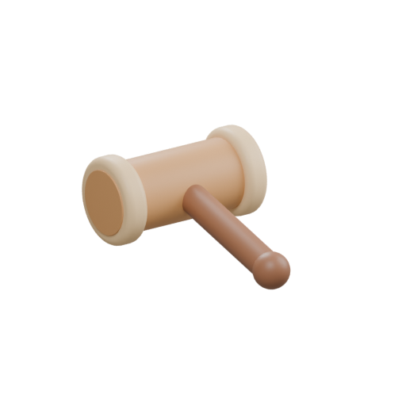

# 낙찰 nackchal

**겉모습만 보고 값을 매기고, 친구보다 한 푼 더 불러 낙찰받는 인형 경매장 파티 게임**

    

 

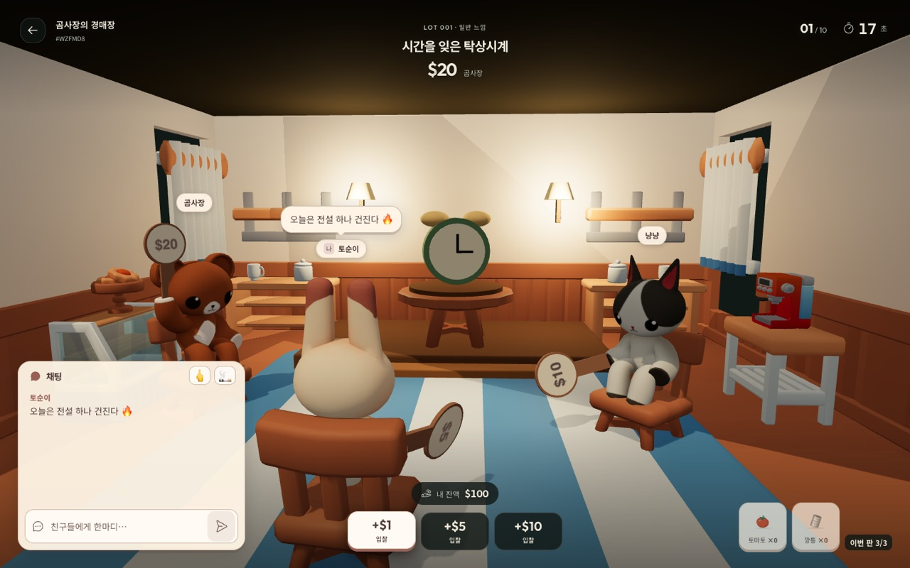

 

  할아버지의 라디오, 필름이 남은 카메라, 제법 당당한 고무 오리… 
  사연 있어 보이는 물건이 하나씩 경매대에 오릅니다. 
  <b>겉모습은 힌트일 뿐.</b> 진짜 가치는 낙찰 5초 뒤에 공개돼요. 
  <b>대박일까, 쪽박일까?</b>

 

## 경매장 단골손님

<table align="center">
  <tr>
    <td align="center">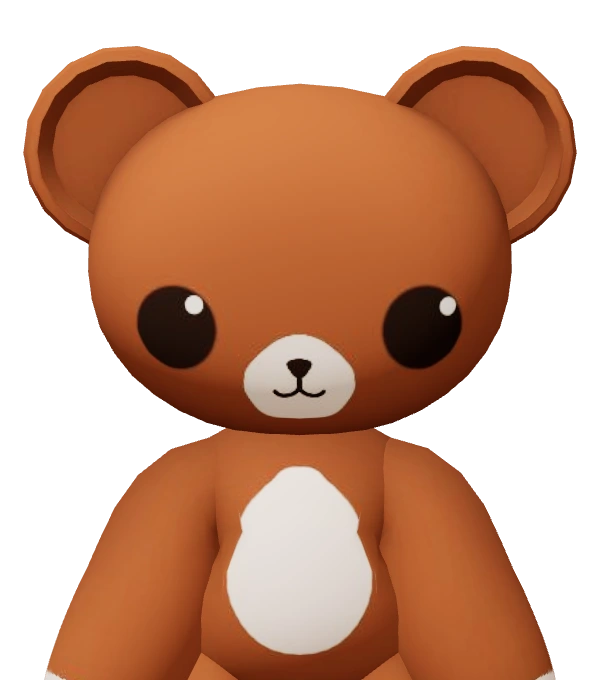 <b>곰</b></td>
    <td align="center">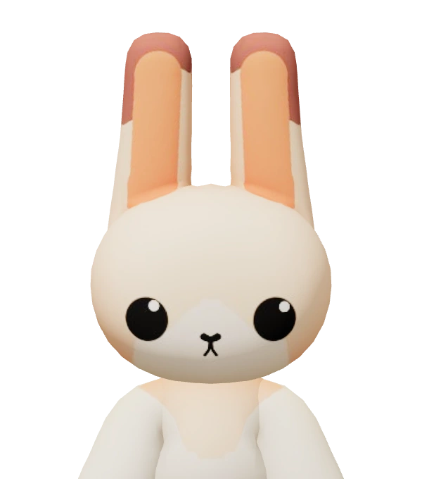 <b>토끼</b></td>
    <td align="center">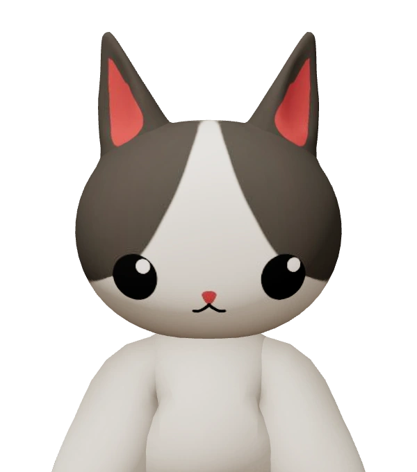 <b>고양이</b></td>
    <td align="center">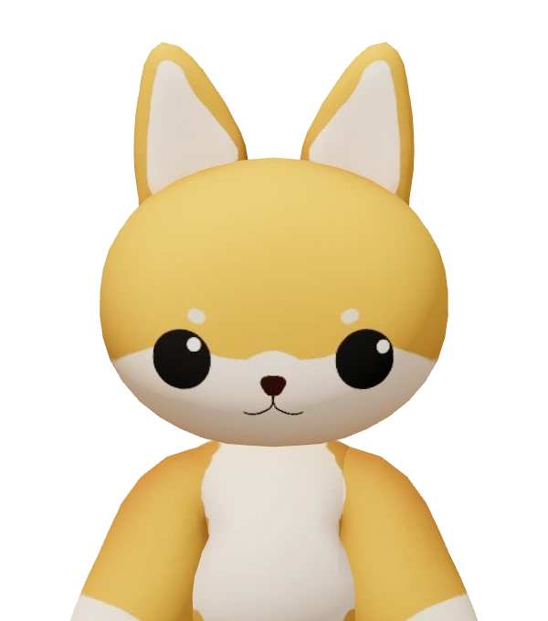 <b>강아지</b></td>
  </tr>
</table>

푹신한 인형들이 의자에 앉아 번호 팻말을 들어요. (캐릭터 고르기는 준비 중이에요. 지금은 모두 곰으로 시작해요.)

## 이렇게 놀아요

| 순서 | 이렇게 |
| :---: | --- |
| **1** | **방에 모여요.** 방을 만들거나 친구의 방에 들어가요. 2~4명이 모두 준비하면 방장이 경매를 시작해요. |
| **2** | **$100으로 시작해요.** 10라운드 동안 물건이 하나씩 올라오고, 라운드마다 20초 동안 공개 호가가 열려요. 첫 입찰은 $5, 그다음은 현재가에 **+$1 · +$5 · +$10**. |
| **3** | **막판 눈치싸움.** 마감 3초 전에 누가 부르면 3초가 다시 늘어나요. (라운드당 최대 15초) |
| **4** | **겉모습은 70%만 맞아요.** 낡아 보여도 전설일 수 있고, 반짝여도 일반일 수 있어요. |
| **5** | **5초 뒤 진짜 가치 공개.** 낙찰가는 바로 빠지고, 실제 가치만큼 돌려받아요. 그 차이가 이번 라운드의 손익! |
| **6** | **마지막에 돈이 가장 많은 사람이 승리.** 중간에 나가면 순위에서 빠져요. |

  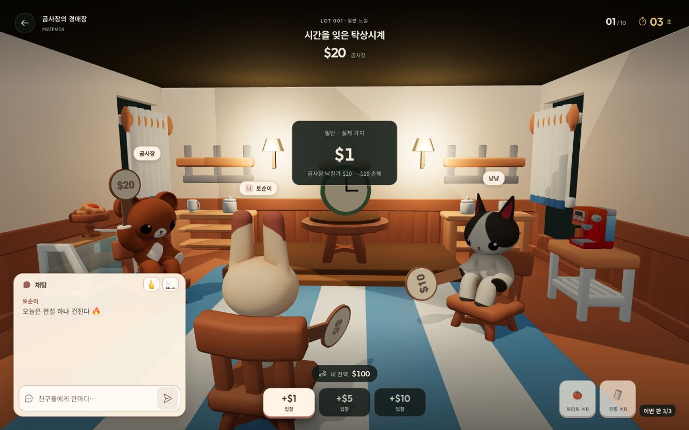
   곰사장, $20에 낙찰… 실제 가치는 <b>$1</b>. 이번 라운드 <b>-$19</b>

### 물건 등급

| 등급 | 나올 확률 | 실제 가치 |
| :---: | :---: | :---: |
| 일반 | 55% | $1 ~ $30 |
| 레어 | 30% | $20 ~ $80 |
| 에픽 | 12% | $60 ~ $150 |
| **전설** | 3% | **$150 ~ $400** |

### 판이 끝나면

| 1등 | 2등 | 나머지 |
| :---: | :---: | :---: |
| **10 캐시** | **5 캐시** | **2 캐시** |

동점이면 같은 순위, 같은 보상이에요. 받은 캐시는 계정에 쌓이고 상점에서 써요.

## 경매는 진지하게, 장난은 자유롭게

<table align="center">
  <tr>
    <td align="center">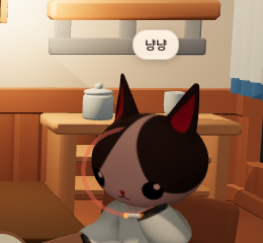</td>
    <td align="center">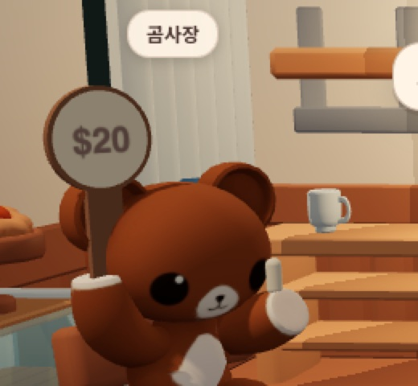</td>
    <td align="center">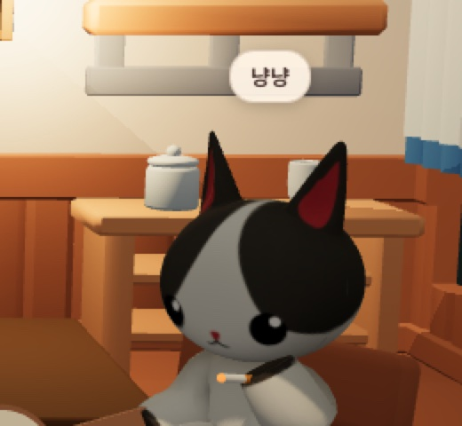</td>
  </tr>
  <tr>
    <td align="center"><b>토마토 · 깡통</b> 상점에서 사서 게임 중 친구에게 휙! 한 판 3개, 같은 친구에겐 5초 간격</td>
    <td align="center"><b>뻐큐</b> 입찰에 밀렸을 때 공짜, 버튼 하나</td>
    <td align="center"><b>담배</b> 표정 관리가 필요할 때 공짜, 버튼 하나</td>
  </tr>
</table>

채팅은 언제든, 캐릭터 머리 위 말풍선으로도 떠요. 장난은 연출일 뿐이라 입찰 · 돈 · 순위에는 아무 영향이 없어요.

## 로비와 장난 상점

<table align="center">
  <tr>
    <td align="center">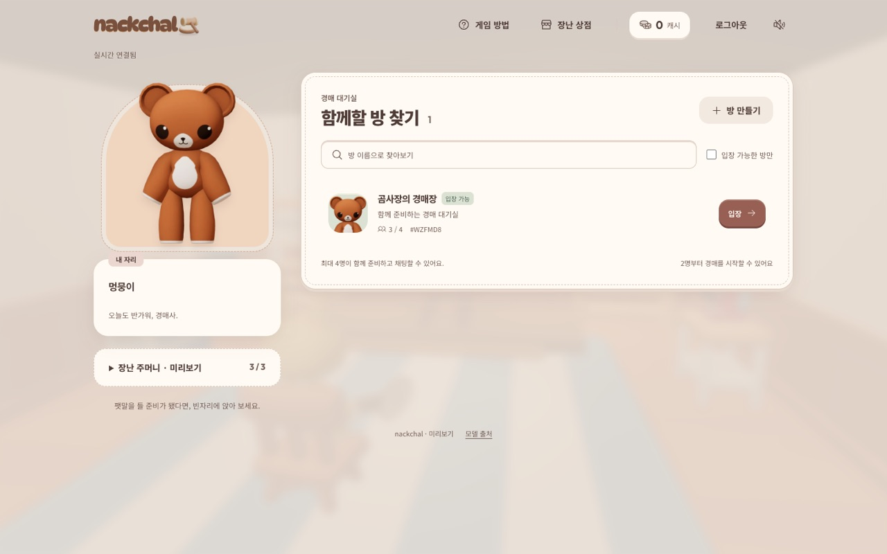 방 찾기 · 방 만들기</td>
    <td align="center">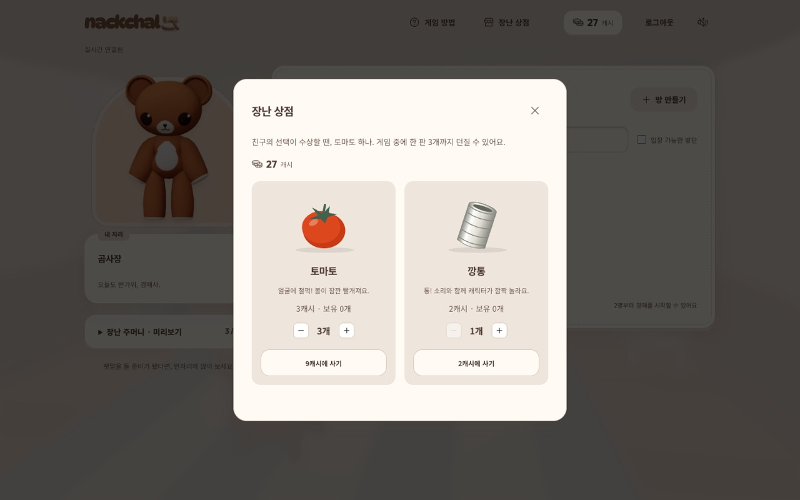 토마토 3캐시 · 깡통 2캐시</td>
  </tr>
</table>

## 만든 이야기

  
  
  
  
  
  
  

- **판정은 전부 서버가.** 입찰 순서, 마감 시각, 숨은 가치, 정산은 서버만 알고 결정해요. 내 화면이 조금 느려도 억울한 낙찰은 없어요.
- **실시간은 빠르게, 기록은 확실하게.** 방과 경매는 서버 메모리에서 실시간으로 돌고, 계정 · 캐시 · 게임 결과 · 아이템은 데이터베이스에 남아요.
- **캐시는 장부로.** 캐시가 오갈 때마다 기록이 남고, 같은 보상이나 같은 구매가 두 번 처리되지 않아요.

| 문서 | 이런 걸 볼 수 있어요 |
| --- | --- |
| [백엔드](backend/README.md) | 서버 구조, 동시성 설계, 데이터 모델, API와 실시간 프로토콜, 경매 · 정산 · 상점 설계 |
| [프론트엔드](frontend/README.md) | 화면 구성, 서버 상태를 화면으로 옮기는 방식, 3D 장면과 연출, 브라우저 검증 |
| [운영 · 배포](deploy/README.md) | 로컬 실행, 운영 서버, HTTPS, 자동 배포, DB 백업, CI |

## 빌려 온 재료

[Animal Plushies](https://moraazul.itch.io/animal-plushies) (MoraAzul) · [Paddles With Numbers](https://www.thingiverse.com/thing:4577011) (jumimo) · [Tiny Treats Bakery Interior](https://tinytreats.itch.io/bakery-interior) (Tiny Treats) · [DynaPuff](https://github.com/googlefonts/dynapuff) (Toshi Omagari)
 출처와 라이선스: [출처 화면](frontend/public/credits.html) · [라이선스 원문](frontend/public/models/licenses)
